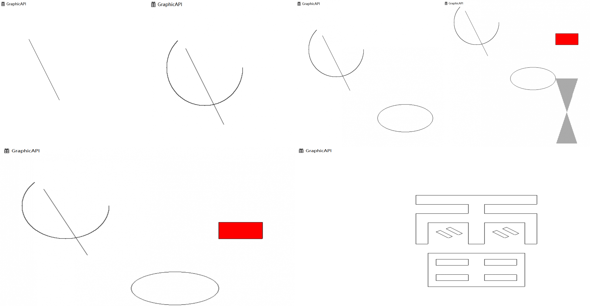

## 一. 实验目的

设计和实现一个图形函数库，具有绘制直线段、任意圆弧、椭圆弧、多边形区域的阴影填充和颜色填充等功能（仅调用画点函数），要求显示功能效果并能使用所设计库函数显示完成者名字。

## 二. 实验环境

1. Windows 10
2. vs 2019

## 三. 实验结果

实现了线段，任意圆弧，完整椭圆，阴影线填充，漫水填充基本函数，以及最后是简单地调用这些函数画的一个 “雷” 字。

